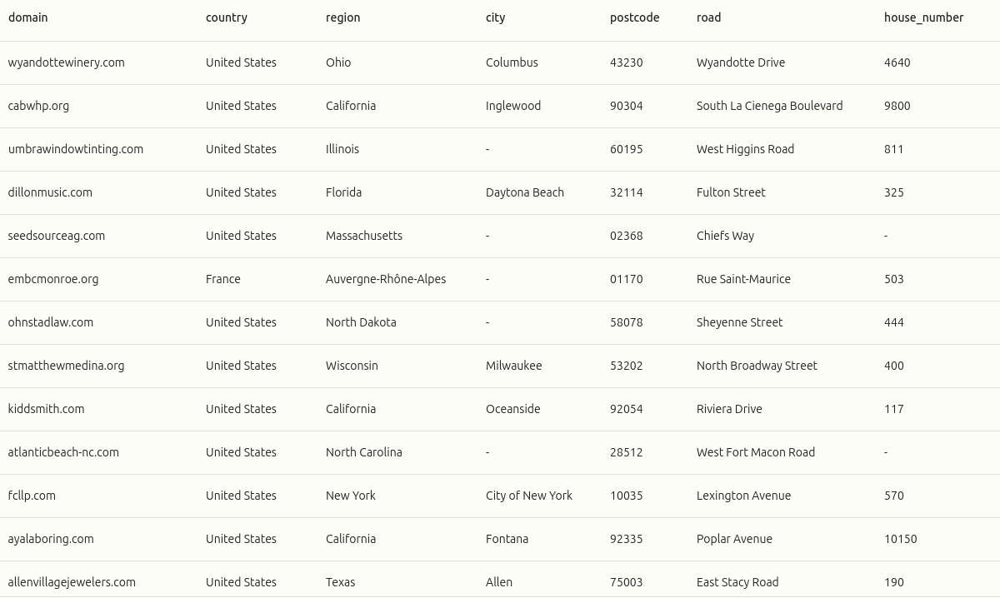

# Veridion Assignment - Address Extraction

This project is a Python application that parses addresses from a list of URLs. <br>
It was made for the role of **"Deeptech Engineer"** Intern at <a href="https://veridion.com/" target="_blank">Veridion</a>

## The given script
Write a program that extracts all the valid addresses that are found on a list of company websites. The format in which you will have to extract this data is the following: country, region, city, postcode, road, and road numbers. 

## My thought process & solution

Firstly we'll have to fetch all the domains. But this gets us only to the home page, where the company's address might not be present.
Usually, an company's address is present either on the **contact page or the about page** of the company. <br>

After fetching the main page, and parsing it using **BeautifulSoup with LXML parser** for a faster parsing experience, we crawl for more URL's. We check all the 'href' attributes of the link tags, and if it contains **'contact'** or **'about'**, we append it to a list. <br>

We also have to take in consideration that some 'href' attributes might not be links, but mails (e.g. mailto:example@mail.com), so we filter them.

For each domain and all it's pages that could contain an adress, we store the response in a list.
Because the list would be too big and would slow down the script, we use a **Chunk-Based approach** (e.g. we parse data in chunks of 500's).

For this **multithreaded** web crawler, we use a semaphore to limit the number of concurrent threads. (This ensures we crawl the websites much much faster).

In the current chunk, each response is parsed using regular expressions. As many websites utilize a common format for street addresses, a widely-used regular expression was used, which successfully matched the majority of the addresses.

After extracting the address from the website, we verify it's existance using a geolocator (e.g. <a href="https://geopy.readthedocs.io/en/stable/" target="_blank">geopy</a>), that uses <a href="https://nominatim.org/" target="_blank">Nominatim</a>, an open-source geocoding service.
However, the project encounters a limitation here as Nominatim restricts usage to **one request per second**, which prevents the use of multithreading for this part of the extraction process.

Nevertheless, this project serves as a solid foundation that can be further enhanced and optimized.

## Additional Features
- **Logging**: The script includes a logging mechanism to track its progress and help diagnose any issues that may arise during execution.
- **Interactive File Selection**: Upon execution, the script utilizes the Tkinter library to open a dialog window, allowing the user to conveniently select the input files.
- **User-Agent Rotation**: To bypass potential access restrictions and avoid detection by servers, the script employs a strategy of rotating User-Agents. This mimics requests coming from different browsers, enhancing the script's ability to successfully retrieve data.

## Future Enhancements
- **Alternative Geocoding Service**: While Nominatim serves the current project needs, integrating an additional geocoding service like Google Maps V3 could enhance the project's capabilities.
- **Proxy Integration**: Incorporating proxies could potentially circumvent the limitations set by Nominatim, improving the efficiency of the data retrieval process.
- **Asynchronous Implementation**: An interesting future direction would be to develop an asynchronous version of the project. This would allow for a comparative study of performance between the multithreaded and asynchronous implementations.
- **Leveraging Machine Learning**: Given the variability in street address formats across different websites, using Artificial Intelligence could significantly improve the address detection rate.

## Installation

1. Clone this repository:
    ```
    git clone https://github.com/steffegit/VeridionAssignment.git
    ```
2. Navigate to the project directory:
    ```
    cd VeridionAssignment
    ```
3. Install the required dependencies:
    ```
    pip install -r requirements.txt
    ```

## Usage
Run the main script by executing `python3 main.py` in your terminal. Ensure you are in the correct directory when running this command.

Please note that the script will prompt you to select an input file. This file should be a **.parquet file** containing the websites you wish to crawl. (e.g. "input/adresses.snappy.parquet")

Upon completion, the script will store its output in the "addresses.snappy.parquet" file within the output directory. The log files generated during the process will also be located in the same output directory.

## Features

- **URL Parsing**: Extracts addresses from a list of URLs provided by the user.
- **Intelligent Page Selection**: Identifies and prioritizes 'contact' and 'about' pages where addresses are most likely to be found.
- **HTML Parsing**: Utilizes BeautifulSoup with the LXML parser for efficient and fast parsing of web pages.
- **Multithreaded Web Crawling**: Usage of a multithreaded approach with a semaphore to limit the number of concurrent threads, significantly speeding up the crawling process.
- **Chunk-Based Approach**: Processes data in manageable chunks to optimize performance and resource usage.
- **Address Extraction**: Uses regular expressions to parse and extract street addresses from the crawled web pages.
- **Geolocation Verification**: Leverages the geopy library and the Nominatim open-source geocoding service to verify the existence of extracted addresses.
- **Logging**: Includes a logging mechanism to track progress and assist in troubleshooting.
- **Interactive File Selection**: Uses the Tkinter library to provide a user-friendly file selection dialog at runtime.
- **User-Agent Rotation**: Implements a strategy of rotating User-Agents to bypass potential access restrictions and avoid detection by servers.

## Results

The script managed to successfully extract **15% addresses in 41 minutes** from the provided list of URLs (mostly because of the short timeout duration - 5 seconds).
I believe that with further optimization and enhancements, the extraction rate could be significantly improved.

